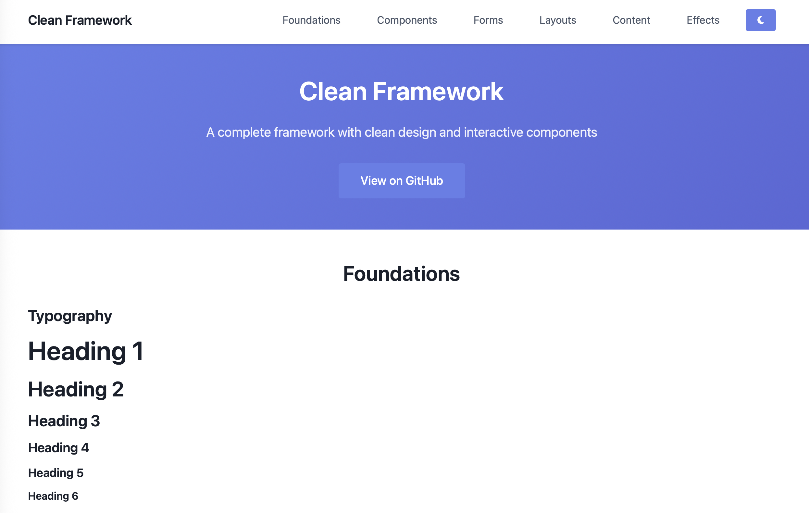

# Clean Framework

**[🔗 View Demo](https://htmlpreview.github.io/?https://raw.githubusercontent.com/tomvon/cleanframework/master/clean-framework-demo.html)** | **[📁 Download CSS](https://raw.githubusercontent.com/tomvon/cleanframework/master/clean-framework.css)** | **[📁 Download JS](https://raw.githubusercontent.com/tomvon/cleanframework/master/clean-framework.js)**

A complete framework specifically designed for AI-assisted development. Clean Framework features predictable class names, semantic HTML patterns, and consistent design principles that work seamlessly with AI coding tools and language models.



## 🎯 Core Principles

- **AI-First Design** - Built specifically for AI-assisted development
- **Predictable Class Names** - Every class follows logical, semantic naming
- **Semantic HTML Structure** - Markup that tells a clear content story
- **Consistent Design Patterns** - Repeatable visual and structural patterns
- **Zero Surprises** - Framework behavior that AI models can predict and generate

## 🚀 Quick Start

### CDN (Recommended for testing)

```html
<!-- Clean Framework -->
<link rel="stylesheet" href="https://cdn.jsdelivr.net/gh/tomvon/cleanframework@master/clean-framework.css">
<script src="https://cdn.jsdelivr.net/gh/tomvon/cleanframework@master/clean-framework.js"></script>
```

### Download

Download the framework files directly:
- [clean-framework.css](https://raw.githubusercontent.com/tomvon/cleanframework/master/clean-framework.css) (Styles - 80KB)
- [clean-framework.js](https://raw.githubusercontent.com/tomvon/cleanframework/master/clean-framework.js) (JavaScript - 8KB)

## 🤖 AI-Friendly Features

**Designed for Large Language Models**
- **Predictable Naming**: `.cf-card`, `.cf-btn-primary`, `.cf-form-group` - every class name is self-documenting
- **Consistent Patterns**: All components follow the same structural conventions
- **Semantic HTML First**: Uses proper HTML5 elements (`<article>`, `<section>`, `<nav>`) over generic divs
- **Logical Hierarchy**: CSS classes that mirror content hierarchy
- **Pattern Recognition**: Repeating design motifs that AI can easily identify and replicate

## 📦 What's Included

Clean Framework is a complete framework with styles and interactive components:

**Foundation Elements**
- CSS Variables & Reset
- Typography system
- Layout utilities (container, grid, flexbox)
- Card components with visual accents
- Button variations
- Navigation components
- Form elements
- Hero sections
- Responsive utilities

**Advanced Components**
- CSS Subgrid layouts
- Animations and micro-interactions  
- Complex form components (multi-step, validation)
- Interactive components (modals, tabs, accordions)
- Media components (galleries, carousels)
- Dashboard layouts
- Magazine-style grids

## 🎨 Design Philosophy

Clean Framework emphasizes **visual consistency** and **semantic structure**:

```html
<div class="cf-card">
    <h3 class="cf-card-title">Default Card</h3>
    <p>Clean, consistent styling with visual accents</p>
</div>

<div class="cf-card cf-card-secondary">
    <h3 class="cf-card-title">Secondary Card</h3>
    <p>Themed variations for different contexts</p>
</div>
```

## 🌟 Key Components

### Cards (The Foundation)
```html
<div class="cf-card">
    <div class="cf-card-header">
        <h3 class="cf-card-title">Card Title</h3>
    </div>
    <div class="cf-card-body">
        <p>Clean, structured content with consistent styling.</p>
    </div>
</div>
```

### Forms
```html
<div class="cf-form-group">
    <label class="cf-form-label">Email</label>
    <input type="email" class="cf-form-input" placeholder="Enter email">
</div>
```

### Buttons
```html
<button class="cf-btn">Primary Button</button>
<button class="cf-btn cf-btn-secondary">Secondary</button>
<button class="cf-btn cf-btn-outline">Outline</button>
```

### Navigation
```html
<nav class="cf-nav">
    <div class="cf-container">
        <div class="cf-nav-container">
            <a href="#" class="cf-nav-brand">Brand</a>
            <ul class="cf-nav-menu">
                <li><a href="#" class="cf-nav-link">Home</a></li>
                <li><a href="#" class="cf-nav-link active">About</a></li>
            </ul>
        </div>
    </div>
</nav>
```

## 📱 Responsive Design

Clean Framework uses a mobile-first approach with intuitive breakpoints:

```css
/* Mobile first - base styles */
.cf-col { flex: 0 0 100%; }

/* Tablet and up */
@media (min-width: 768px) {
    .cf-col-6 { flex: 0 0 50%; }
}

/* Desktop and up */  
@media (min-width: 1024px) {
    .cf-col-4 { flex: 0 0 33.333%; }
}
```

## 🎭 CSS Variables

Customize the entire framework with CSS custom properties:

```css
:root {
    --cf-primary: #667eea;        /* Main brand color */
    --cf-secondary: #48bb78;      /* Success/secondary color */
    --cf-border-radius: 8px;      /* Global border radius */
    --cf-spacing-md: 1rem;        /* Base spacing unit */
    --cf-font-sans: 'Your Font'; /* Typography */
}
```

## 🌙 Dark Mode

Built-in dark mode support:

```html
<html data-theme="dark">
    <!-- Automatic dark mode for all components -->
</html>
```

## 🤖 AI Code Generation

Clean Framework is optimized for AI code generation. Here's what makes it work:

### Predictable Class Patterns
```html
<!-- AI can easily predict these patterns -->
<div class="cf-card cf-card-primary">
    <div class="cf-card-header">
        <h3 class="cf-card-title">Card Title</h3>
    </div>
    <div class="cf-card-body">
        <p>Content</p>
    </div>
</div>
```

### Semantic HTML Structure
```html
<!-- Framework encourages proper semantic HTML -->
<article class="cf-card">
    <header class="cf-card-header">
        <h2>Article Title</h2>
    </header>
    <section class="cf-card-body">
        <p>Article content...</p>
    </section>
</article>
```

### Consistent Naming Convention
- `.cf-[component]` - Base component
- `.cf-[component]-[variant]` - Component variants  
- `.cf-[component]-[element]` - Child elements
- `.cf-[component].cf-[state]` - Component states

This predictable structure allows AI models to generate accurate, consistent code without requiring extensive framework-specific training.

## 🚀 Advanced Components

### Multi-Step Forms
```html
<div class="cf-form-container">
    <div class="cf-form-node cf-form-node-active">
        <!-- Step content with navigation -->
    </div>
</div>
```

### CSS Subgrid Layouts
```html
<div class="cf-grid-article">
    <main class="cf-grid-article-main">
        <!-- Perfectly aligned content -->
    </main>
    <aside class="cf-grid-article-sidebar">
        <!-- Sidebar that aligns with main -->
    </aside>
</div>
```

### Interactive Components
```html
<!-- Modal -->
<div class="cf-modal" id="myModal">
    <div class="cf-modal-content">
        <!-- Modal content -->
    </div>
</div>

<!-- Tabs -->
<div class="cf-tabs">
    <div class="cf-tab active">Tab 1</div>
    <div class="cf-tab-content active">Content 1</div>
</div>
```

## 📖 Examples

See the **[Live Demo](https://htmlpreview.github.io/?https://raw.githubusercontent.com/tomvon/cleanframework/master/clean-framework-demo.html)** for a comprehensive showcase of all components and layouts.

### Basic Page Structure
```html
<!DOCTYPE html>
<html lang="en">
<head>
    <link rel="stylesheet" href="clean-framework.css">
</head>
<body>
    <!-- Your content here -->
    
    <!-- Before closing body tag -->
    <script src="clean-framework.js"></script>
</body>
<body>
    <nav class="cf-nav">
        <div class="cf-container">
            <div class="cf-nav-container">
                <a href="#" class="cf-nav-brand">My Site</a>
            </div>
        </div>
    </nav>

    <section class="cf-hero">
        <div class="cf-container">
            <h1 class="cf-hero-title">Welcome</h1>
            <p class="cf-hero-subtitle">Clean, semantic design</p>
        </div>
    </section>

    <section class="cf-section">
        <div class="cf-container">
            <div class="cf-row">
                <div class="cf-col-4">
                    <div class="cf-card">
                        <h3>Feature 1</h3>
                        <p>Clean, structured content</p>
                    </div>
                </div>
            </div>
        </div>
    </section>
</body>
</html>
```

## 🛠️ Development

### Browser Support
- Chrome 88+
- Firefox 87+  
- Safari 14+
- Edge 88+

### CSS Features Used
- CSS Grid & Subgrid (with fallbacks)
- CSS Custom Properties
- Flexbox
- CSS Animations
- Container Queries (progressive enhancement)

## 📄 License

MIT License - see [LICENSE](LICENSE) file for details.

## 🤝 Contributing

Contributions are welcome! Please read our [Contributing Guidelines](CONTRIBUTING.md) first.

1. Fork the repository
2. Create your feature branch (`git checkout -b feature/amazing-feature`)
3. Commit your changes (`git commit -m 'Add amazing feature'`)
4. Push to the branch (`git push origin feature/amazing-feature`)
5. Open a Pull Request

## 📚 Resources

- [Live Demo](https://htmlpreview.github.io/?https://raw.githubusercontent.com/tomvon/cleanframework/master/clean-framework-demo.html) - Live component showcase
- [Documentation](https://github.com/tomvon/cleanframework/wiki) - Detailed guides
- [Issues](https://github.com/tomvon/cleanframework/issues) - Bug reports & feature requests

## 🙏 Acknowledgments

Clean Framework was developed through extensive collaboration with AI development tools to create optimal patterns for AI-assisted coding. This framework represents a new approach to CSS frameworks - one designed from the ground up to work seamlessly with large language models and AI coding assistants.

**AI Development Philosophy**: Every design decision prioritizes predictability and pattern consistency to enable AI tools to generate accurate, maintainable code. This framework serves as a bridge between human design intent and AI code generation capabilities.

## ⭐ Support

If you find Clean Framework useful, please consider giving it a star on GitHub!

---

**Clean Framework** - The first CSS framework engineered specifically for the AI-assisted development era. Built with ❤️ for developers and their AI coding companions.